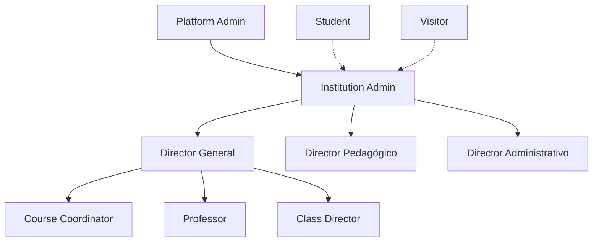

# 📚 Angola Education Hub - Documentação Completa do Projeto

## 🎯 Visão Geral do Projeto

O **Angola Education Hub** é uma plataforma educacional digital abrangente que conecta estudantes, instituições de ensino e oportunidades educacionais em Angola. A plataforma funciona como uma ponte entre quem busca educação e quem oferece, com ferramentas avançadas de gestão, comunicação e análise.

### 🚀 Objetivos Principais

- **Democratizar o acesso à educação** em Angola através da tecnologia
- **Centralizar informações** educacionais do país em uma plataforma única
- **Facilitar candidaturas** e processos de inscrição online
- **Conectar stakeholders** do ecossistema educacional
- **Proporcionar visibilidade** para instituições de ensino
- **Criar uma rede social educacional** dinâmica e engajada

---

## 🏗️ Arquitetura e Stack Tecnológico

### **Frontend**
- **React 18.3.1** - Biblioteca principal
- **TypeScript** - Tipagem estática
- **Vite** - Build tool e dev server
- **React Router DOM 6.26.2** - Roteamento
- **TailwindCSS 3.4.11** - Framework CSS utilitário
- **Shadcn/ui** - Sistema de componentes baseado em Radix UI
- **React Hook Form 7.53.0** - Gerenciamento de formulários
- **React Query (TanStack Query) 5.56.2** - Cache e sincronização de estado servidor

### **Backend & Infraestrutura**
- **Supabase** - Backend-as-a-Service (BaaS)
  - Autenticação nativa
  - PostgreSQL como banco de dados
  - Row Level Security (RLS)
  - Edge Functions
  - Storage de arquivos
  - Realtime subscriptions

### **Styling & UI/UX**
- **Design System personalizado** com tokens semânticos
- **Modo escuro/claro** suportado nativamente
- **Componentes responsivos** mobile-first
- **Animações fluidas** com Tailwind Animate
- **Ícones**: Lucide React
- **Toast notifications**: Sonner
- **Calendário**: React Day Picker

### **Ferramentas de Desenvolvimento**
- **ESLint** - Linting
- **Prettier** (implícito via Lovable)
- **TypeScript ESLint** - Regras específicas do TS
- **Lovable Tagger** - Ferramenta específica da plataforma

---

## 📂 Estrutura de Diretórios

```
angola-education-hub/
├── public/
│   ├── favicon.ico
│   ├── robots.txt
│   └── placeholder.svg
├── src/
│   ├── assets/           # Imagens e recursos estáticos
│   ├── components/       # Componentes reutilizáveis
│   │   ├── guards/      # Proteção de rotas
│   │   ├── invites/     # Sistema de convites
│   │   ├── layout/      # Layouts da aplicação
│   │   └── ui/          # Componentes UI base (shadcn)
│   ├── hooks/           # Custom hooks React
│   ├── integrations/    # Integrações externas (Supabase)
│   ├── lib/             # Utilitários e configurações
│   ├── pages/           # Páginas da aplicação
│   │   ├── admin/       # Páginas administrativas
│   │   └── roles/       # Páginas específicas de papéis
│   ├── types/           # Definições TypeScript
│   └── utils/           # Funções utilitárias
├── supabase/            # Configurações Supabase
│   ├── config.toml
│   └── functions/       # Edge Functions
└── tailwind.config.ts   # Configuração Tailwind
```

---

## 👥 Sistema de Usuários e Permissões

### **Hierarquia de Usuários**



### **Tipos de Usuário**

#### 🧭 **Visitor (Visitante)**
- **Descrição**: Usuário cadastrado mas sem vínculos institucionais
- **Permissões**:
  - Visualizar instituições públicas
  - Seguir instituições
  - Interagir com posts públicos (curtir, comentar)
  - Salvar cursos favoritos
  - Solicitar upgrade para estudante
  - Receber convites institucionais

#### 🎓 **Student (Estudante)**
- **Descrição**: Usuário ativo para candidaturas e participação plena
- **Permissões**:
  - Todas as permissões de visitante
  - Candidatar-se a cursos
  - Upload de documentos
  - Chat com instituições
  - Participar de fóruns privados
  - Avaliar instituições

#### 🏫 **Institution Admin (Administrador Institucional)**
- **Descrição**: Primeiro usuário da instituição, com acesso total
- **Permissões**:
  - Gestão completa da instituição
  - Convitar e gerenciar equipe
  - Aprovar/rejeitar candidaturas
  - Configurar planos premium
  - Analytics completos

#### 👨‍🏫 **Subperfis Institucionais**
- **Professor**: Criação de conteúdo, interação com alunos
- **Course Coordinator**: Gestão de cursos e professores
- **Director**: Supervisão geral, relatórios, decisões estratégicas
- **Secretary**: Gestão de documentos e cronogramas

#### 👑 **Platform Admin (Administrador da Plataforma)**
- **Descrição**: Fundador/proprietário com acesso global
- **Permissões**: Controle total da plataforma

---

## 🎨 Design System

### **Paleta de Cores (HSL)**
```css
/* Cores primárias */
--primary: 217 91% 60%;        /* Azul vibrante */
--secondary: 142 76% 36%;      /* Verde educacional */
--accent: 45 93% 47%;          /* Amarelo destaque */

/* Cores funcionais */
--success: 142 76% 36%;        /* Verde sucesso */
--warning: 38 92% 50%;         /* Laranja aviso */
--destructive: 0 84.2% 60.2%;  /* Vermelho erro */

/* Gradientes */
--gradient-primary: linear-gradient(135deg, hsl(217 91% 60%), hsl(142 76% 36%));
--gradient-secondary: linear-gradient(135deg, hsl(142 76% 85%), hsl(217 91% 85%));
```

### **Tipografia**
- **Fonte principal**: Inter (sistema fallback: -apple-system, BlinkMacSystemFont)
- **Hierarquia**: H1-H6 com escalas harmônicas
- **Classes utilitárias**: `.gradient-text` para textos com gradiente

### **Componentes Base**
- **Buttons**: 6 variantes (primary, secondary, accent, ghost, outline, destructive)
- **Cards**: Efeito glassmorphism com backdrop-blur
- **Forms**: Inputs modernos com focus states avançados
- **Navigation**: Active states e hover effects suaves

---

## 🌐 Estrutura de Páginas

### **📄 Páginas Públicas (8 páginas)**
1. **Landing Page** (`/`) - Página inicial com hero section
2. **About** (`/about`) - Sobre a plataforma
3. **Discover** (`/discover`) - Descobrir instituições
4. **Terms** (`/terms`) - Termos de uso
5. **Privacy** (`/privacy`) - Política de privacidade LGPD Angola
6. **FAQ** (`/faq`) - Perguntas frequentes
7. **Pricing** (`/pricing`) - Planos premium
8. **Contact** (`/contact`) - Página de contato

### **🔐 Área Visitante (5 páginas)**
- Dashboard Visitante
- Explorar Instituições
- Candidatar-se
- Receber Convites
- Perfil Pessoal

### **🎓 Área Estudante (7 páginas)**
- Dashboard Estudante
- Candidaturas
- Acompanhar Respostas
- Minhas Instituições
- Meus Cursos
- Mensagens/Notificações
- Perfil Acadêmico

### **🏫 Área Institucional (12 páginas)**
- Dashboard Institucional
- Gestão de Candidaturas
- Gestão de Cursos
- Gestão de Convites
- Gestão de Equipe
- Gestão de Estudantes
- Analytics Institucional
- Plano Premium
- Histórico de Atividades
- Configurações
- Mensagens
- Página Pública da Instituição

### **👑 Área Administrativa (5 páginas)**
- Dashboard Mestre
- Gestão de Usuários
- Gestão de Instituições
- Analytics Globais
- Configurações do Sistema

---

## 🔐 Sistema de Autenticação e Segurança

### **Autenticação**
```typescript
interface AuthContextType {
  user: User | null;
  userProfile: any | null;
  session: Session | null;
  login: (email: string, password: string) => Promise<boolean>;
  signup: (data: SignupData) => Promise<boolean>;
  logout: () => Promise<void>;
  resetPassword: (email: string) => Promise<boolean>;
  isLoading: boolean;
}
```

### **Route Guards**
- **RouteGuard**: Guard genérico baseado em roles e permissões
- **VisitorGuard**: Protege rotas de visitantes
- **StudentGuard**: Protege rotas de estudantes
- **InstitutionStaffGuard**: Protege rotas institucionais
- **PlatformAdminGuard**: Protege área administrativa
- **PublicOnlyGuard**: Redireciona usuários logados de páginas públicas

### **Permissões por Role**
```typescript
const ROLE_PERMISSIONS: Record<UserRole, string[]> = {
  visitor: ['view_public', 'follow_institutions', 'like_posts'],
  student: ['view_public', 'follow_institutions', 'like_posts', 'comment', 'apply_courses'],
  professor: ['create_posts', 'comment', 'view_followers'],
  institution_admin: ['edit_institution', 'manage_members', 'publish', 'full_access'],
  platform_admin: ['approve_institutions', 'platform_metrics', 'full_platform_access']
};
```

---

## 🗄️ Banco de Dados (Supabase)

### **Tabelas Principais**

#### **profiles**
```sql
CREATE TABLE profiles (
  id UUID REFERENCES auth.users(id) PRIMARY KEY,
  name TEXT NOT NULL,
  email TEXT UNIQUE NOT NULL,
  role user_role NOT NULL DEFAULT 'visitor',
  institution_id UUID REFERENCES institutions(id),
  status user_status NOT NULL DEFAULT 'active',
  avatar_url TEXT,
  created_at TIMESTAMP WITH TIME ZONE DEFAULT NOW(),
  updated_at TIMESTAMP WITH TIME ZONE DEFAULT NOW()
);
```

#### **institutions**
```sql
CREATE TABLE institutions (
  id UUID DEFAULT gen_random_uuid() PRIMARY KEY,
  name TEXT NOT NULL,
  type institution_type NOT NULL,
  email TEXT UNIQUE NOT NULL,
  phone TEXT,
  location TEXT,
  description TEXT,
  logo_url TEXT,
  status institution_status DEFAULT 'pending',
  admin_id UUID REFERENCES profiles(id),
  created_at TIMESTAMP WITH TIME ZONE DEFAULT NOW()
);
```

#### **courses**
```sql
CREATE TABLE courses (
  id UUID DEFAULT gen_random_uuid() PRIMARY KEY,
  institution_id UUID REFERENCES institutions(id) NOT NULL,
  name TEXT NOT NULL,
  description TEXT,
  duration TEXT,
  price DECIMAL,
  vacancies INTEGER,
  requirements TEXT[],
  created_at TIMESTAMP WITH TIME ZONE DEFAULT NOW()
);
```

#### **applications**
```sql
CREATE TABLE applications (
  id UUID DEFAULT gen_random_uuid() PRIMARY KEY,
  student_id UUID REFERENCES profiles(id) NOT NULL,
  course_id UUID REFERENCES courses(id) NOT NULL,
  status application_status DEFAULT 'pending',
  documents JSONB,
  created_at TIMESTAMP WITH TIME ZONE DEFAULT NOW(),
  updated_at TIMESTAMP WITH TIME ZONE DEFAULT NOW()
);
```

### **Row Level Security (RLS)**
- Políticas de acesso baseadas no role do usuário
- Isolamento de dados por instituição
- Proteção de informações pessoais sensíveis

---

## 🚀 Funcionalidades Implementadas

### **✅ Core Features**
- [x] Sistema de autenticação completo
- [x] Guards de proteção de rotas
- [x] Dashboard dinâmico por perfil
- [x] Layout responsivo mobile-first
- [x] Design system consistente
- [x] Navegação intuitiva com sidebar
- [x] Estrutura de páginas completa
- [x] Sistema de permissões robusto
- [x] Integração Supabase configurada

### **🎨 UI/UX Features**
- [x] Dark/Light mode support
- [x] Glassmorphism effects
- [x] Smooth animations
- [x] Loading states
- [x] Toast notifications
- [x] Responsive design
- [x] Accessibility features
- [x] Custom scrollbars

### **🔧 Developer Experience**
- [x] TypeScript strict mode
- [x] ESLint configuration
- [x] Component organization
- [x] Custom hooks
- [x] Error boundaries
- [x] Development tools

---

## 🎯 Funcionalidades Pendentes de Implementação

### **📊 Analytics e Métricas**
- [ ] Dashboard de estatísticas institucionais
- [ ] Métricas de engajamento por curso
- [ ] Relatórios de conversão
- [ ] Analytics de tráfego por região
- [ ] Exportação de dados (CSV/PDF)

### **💬 Sistema de Comunicação**
- [ ] Chat em tempo real (Supabase Realtime)
- [ ] Sistema de mensagens internas
- [ ] Notificações push
- [ ] Sistema de comentários em posts
- [ ] Fóruns por instituição/curso

### **📱 Feed Social Educacional**
- [ ] Timeline de posts institucionais
- [ ] Sistema de likes e shares
- [ ] Moderação de conteúdo
- [ ] Filtros por categoria/instituição
- [ ] Stories educacionais

### **🤖 Funcionalidades IA**
- [ ] Recomendação de cursos personalizadas
- [ ] Chatbot de suporte
- [ ] Análise de sentimento em feedbacks
- [ ] Moderação automática de conteúdo
- [ ] Matching inteligente instituição-estudante

### **📧 Sistema de Notificações**
- [ ] Email notifications (Supabase Functions)
- [ ] Push notifications
- [ ] SMS integration (Angola Telecom)
- [ ] Calendário de eventos
- [ ] Lembretes automáticos

### **💰 Monetização**
- [ ] Sistema de planos premium
- [ ] Gateway de pagamento (Multicaixa)
- [ ] Gestão de faturas
- [ ] Relatórios financeiros
- [ ] Comissões por conversão

### **🗺️ Recursos Geográficos**
- [ ] Mapa interativo de instituições
- [ ] Filtros por província/município
- [ ] Geolocalização de usuários
- [ ] Rotas e direções
- [ ] Densidade educacional por região

### **📄 Gestão de Documentos**
- [ ] Upload/download seguro
- [ ] Verificação de documentos
- [ ] Assinatura digital
- [ ] Versionamento de arquivos
- [ ] Backup automático

---

## 🔗 Integrações Externas

### **📧 Email Service**
- **Supabase Auth** - Emails transacionais
- **Future**: SendGrid/Mailgun para marketing

### **💳 Pagamentos**
- **Multicaixa** - Principal meio de pagamento angolano
- **Future**: Visa/Mastercard, mobile money

### **📍 Mapas & Localização**
- **Google Maps API** - Visualização de instituições
- **Geocoding** - Conversão endereço-coordenadas

### **📱 Comunicação**
- **WhatsApp Business API** - Suporte e notificações
- **Future**: SMS Gateway Angola Telecom

### **📊 Analytics**
- **Supabase Analytics** - Métricas básicas
- **Future**: Google Analytics 4, Mixpanel

---

## 🛠️ Como Replicar o Projeto

### **1. Pré-requisitos**
```bash
# Node.js 18+ e npm
node --version  # v18.0.0+
npm --version   # 8.0.0+

# Git
git --version
```

### **2. Clonagem e Setup**
```bash
# Clonar repositório
git clone <repository-url>
cd angola-education-hub

# Instalar dependências
npm install

# Configurar variáveis de ambiente
cp .env.example .env.local
```

### **3. Configuração Supabase**
1. Criar projeto no [Supabase](https://supabase.com)
2. Obter URL e chave anônima
3. Configurar no arquivo `.env.local`:
```env
VITE_SUPABASE_URL=https://seu-projeto.supabase.co
VITE_SUPABASE_ANON_KEY=sua-chave-anonima
```

### **4. Banco de Dados**
```sql
-- Executar no Supabase SQL Editor
-- 1. Criar tipos customizados
CREATE TYPE user_role AS ENUM (
  'visitor', 'student', 'institution_admin', 
  'director', 'course_coordinator', 'professor', 
  'secretary', 'platform_admin'
);

-- 2. Criar tabelas principais
-- (Ver esquemas de tabela na seção anterior)

-- 3. Configurar RLS políticas
-- (Políticas específicas por tabela e role)
```

### **5. Execução Local**
```bash
# Desenvolvimento
npm run dev

# Build de produção
npm run build

# Preview da build
npm run preview
```

### **6. Deploy**
```bash
# Via Lovable (recomendado)
# Usar botão "Publish" na interface

# Ou via Vercel
npm i -g vercel
vercel deploy

# Ou via Netlify
npm run build
# Upload da pasta dist/
```

---

## 📋 Melhorias Sugeridas

### **🚀 Performance**
- **Lazy Loading**: Componentes pesados carregados sob demanda
- **Code Splitting**: Dividir bundles por rota
- **Image Optimization**: WebP, lazy loading, CDN
- **Caching Strategy**: Service Workers, React Query configurado
- **Bundle Analysis**: Webpack Bundle Analyzer

### **🔐 Segurança**
- **HTTPS Everywhere**: Forçar SSL
- **CSP Headers**: Content Security Policy
- **Rate Limiting**: Prevenir spam e ataques
- **Input Validation**: Sanitização rigorosa
- **LGPD Compliance**: Auditoria completa de privacidade

### **📱 Mobile Experience**
- **PWA**: Progressive Web App com service workers
- **App Shell**: Loading instantâneo
- **Offline Mode**: Funcionalidade básica offline
- **Push Notifications**: Engagement móvel
- **Touch Gestures**: Navegação natural

### **🧪 Qualidade de Código**
- **Unit Tests**: Jest + React Testing Library
- **Integration Tests**: Cypress ou Playwright
- **E2E Tests**: Cenários críticos automatizados
- **Code Coverage**: Mínimo 80%
- **Storybook**: Documentação de componentes

### **📊 Observabilidade**
- **Error Tracking**: Sentry integration
- **Performance Monitoring**: Web Vitals
- **User Analytics**: Hotjar/FullStory
- **A/B Testing**: Feature flags
- **Logging Strategy**: Structured logs

### **🌐 Internacionalização**
- **i18n Setup**: React-i18next
- **Português/English**: Suporte bilíngue
- **Currency**: Kwanza/USD
- **Date/Time**: Formatos locais
- **Cultural Adaptations**: Contexto angolano

---

## 🤝 Contatos da Plataforma

### **📧 Suporte**
- **Email**: angoeducation@gmail.com
- **WhatsApp**: +244 954 789 965

### **📱 Redes Sociais**
- **Instagram**: [@ango_education](https://instagram.com/ango_education)
- **YouTube**: [@AngoEducation](https://youtube.com/@AngoEducation)

### **🏢 Institucional**
- **Fundador**: Elsio Costa
- **Localização**: Angola
- **Missão**: Democratizar educação através da tecnologia

---

## 📈 Roadmap de Desenvolvimento

### **Q1 2024**
- [x] MVP completo com autenticação
- [x] Sistema de usuários e permissões
- [x] Dashboards básicos por perfil
- [x] Design system robusto

### **Q2 2024**
- [ ] Sistema de mensagens em tempo real
- [ ] Analytics institucionais
- [ ] Planos premium e monetização
- [ ] Mapa interativo de instituições

### **Q3 2024**
- [ ] Mobile app (React Native)
- [ ] IA para recomendações
- [ ] Integrações de pagamento
- [ ] Sistema de certificações

### **Q4 2024**
- [ ] Expansão regional (PALOP)
- [ ] Marketplace de cursos
- [ ] Gamificação educacional
- [ ] Parcerias institucionais

---

## 📚 Recursos Adicionais

### **🎓 Documentação Técnica**
- [React Documentation](https://react.dev)
- [Supabase Docs](https://supabase.com/docs)
- [TailwindCSS Guide](https://tailwindcss.com/docs)
- [TypeScript Handbook](https://www.typescriptlang.org/docs)

### **🛠️ Ferramentas de Desenvolvimento**
- [Lovable Platform](https://lovable.dev)
- [VS Code Extensions](https://code.visualstudio.com/docs/editor/extension-marketplace)
- [React DevTools](https://react.dev/learn/react-developer-tools)
- [Supabase Studio](https://supabase.com/studio)

### **📖 Padrões e Boas Práticas**
- [React Patterns](https://react.dev/learn/thinking-in-react)
- [TypeScript Best Practices](https://typescript-eslint.io/rules)
- [Accessibility Guidelines](https://www.w3.org/WAI/WCAG21/quickref)
- [Performance Optimization](https://web.dev/performance)

---

*Documentação criada por Elsio Costa - Angola Education Hub*
*Última atualização: Setembro 2024*
*Versão: 1.0.0*